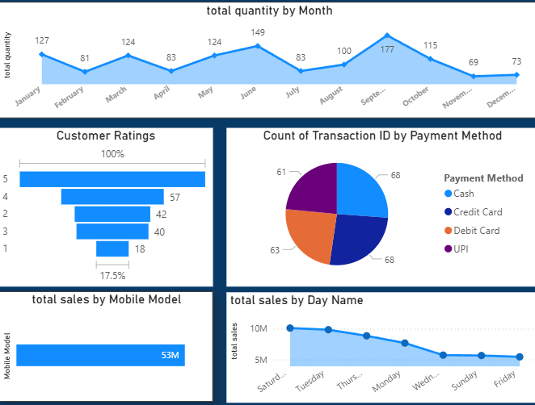
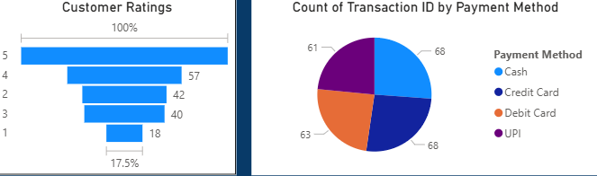

# Motorola Sales Analysis – Power BI

## 📊 Project Overview
This project analyzes Motorola mobile sales data using Microsoft Power BI.  
The dashboard provides insights into total sales, quantity sold, transactions, city-wise performance, payment methods, and customer ratings to support business decision-making.

---

## 📑 Table of Contents
- [Project Overview](#-project-overview)
- [Tools Used](#-tools-used)
- [Dataset Information](#-dataset-information)
- [Data Preparation](#-data-preparation)
- [Dashboard Analysis](#-dashboard-analysis)
- [Key Insights](#-key-insights)
- [Dashboard Preview](#-dashboard-preview)
- [Project Structure](#-project-structure)
- [How to Use](#-how-to-use)
- [Conclusion](#-conclusion)

---

## 🛠 Tools Used
- Microsoft Power BI  
- Power Query  
- DAX  
- Microsoft Excel  

---

## 📁 Dataset Information
The dataset includes Motorola mobile sales data with the following attributes:
- Total sales amount
- Quantity sold
- Number of transactions
- City-wise sales
- Month and day-based sales
- Payment methods
- Customer ratings
- Brand and mobile model details

---

## 🧹 Data Preparation
- Cleaned and transformed data using Power Query  
- Removed duplicates and handled missing values  
- Corrected data types for date and numeric fields  
- Created calculated measures using DAX for KPIs  

---

## 📈 Dashboard Analysis
The Power BI dashboard includes:
- KPI cards for Total Sales, Quantity, Transactions, and Average Sales  
- Monthly sales trend analysis  
- Day-wise sales performance  
- City-wise sales distribution using map visualization  
- Payment method analysis using pie chart  
- Customer ratings analysis  
- Interactive slicers for brand, model, month, and payment method  

---

## 💡 Key Insights
- Identified top-performing cities contributing to overall sales  
- Observed monthly trends in sales quantity  
- Analyzed preferred payment methods among customers  
- Evaluated customer satisfaction through ratings  

---

## 🖼 Dashboard Preview

### Overall Dashboard

### Sales Trends

### City-wise Sales

### Customer & Payment Analysis

---

## 📂 Project Structure
Excel datset 
Screenshots
PowerBi file
Readme
---

## ▶️ How to Use
1. Download or clone this repository  
2. Open the `.pbix` file using Power BI Desktop  
3. Use slicers to interact with the dashboard  
4. View screenshots if Power BI Desktop is not available  

---

## ✅ Conclusion
This project demonstrates practical Power BI skills including data cleaning, DAX calculations, and dashboard development.  
It showcases the ability to transform raw sales data into meaningful business insights using visual analytics.

---
## 👤 Author
Shreya Chanore 
